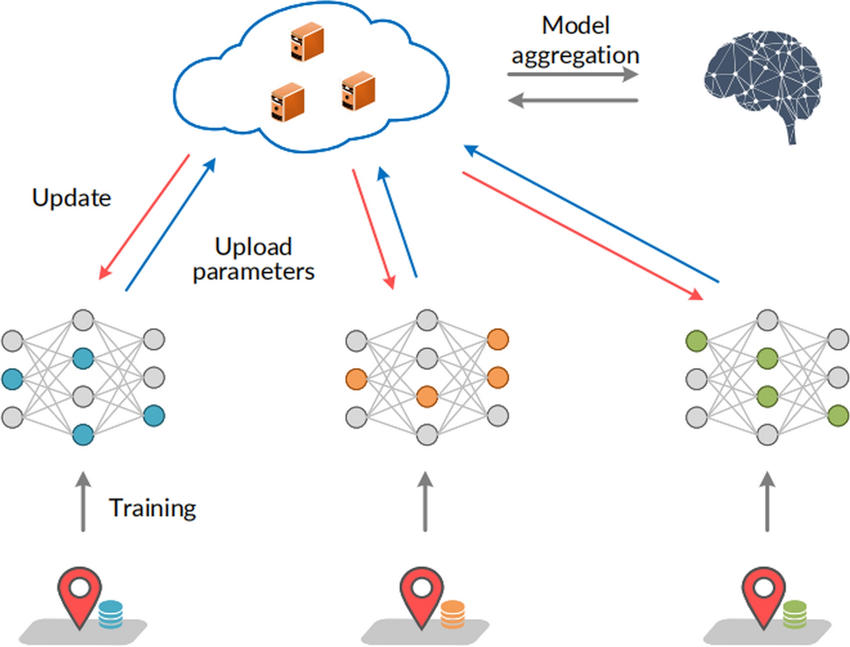

# Towards Decentralized Training of Machine Learning Models for Image Classification

    

[Img source](https://www.researchgate.net/publication/368985559_Secure_sharing_of_industrial_IoT_data_based_on_distributed_trust_management_and_trusted_execution_environments_a_federated_learning_approach)

## Capstone Project Overview
The Capstone Project is a part of my Master of Data Science program at the University of British Columbia, Vancouver. This project presents a federated learning implementation for image classification using the _Flower_ framework. It utilizes an open-source [Osteosarcoma dataset](https://wiki.cancerimagingarchive.net/pages/viewpage.action?pageId=52756935), which contains 1,144 images categorized into three classes i.e. non-tumor, necrotic tumor, and viable tumor. By employing federated learning techniques, we aimed to enhance data privacy, minimize communication overhead, and improve the efficiency of training models distributed across multiple institutions.

## Project Features
The following are the features of this project:

- Implementation of federated learning using the `Flower` framework.
- Supports multiple data partitioning techniques: IID (PyTorch `random_split`) and Non-IID (Dirichlet distribution).
- Includes various aggregation strategies such as FedAvg, FedProx, FedAvgM, and FedTrimmedAvg that cover different data distributions.
- Configurable through a single YAML file for ease of experimentation.
- Pre-configured to work with the Osteosarcoma dataset.

## Final Report
The final report can be found here - [Final Report](https://github.com/karan-khubdikar/Capstone_Project/blob/main/Final%20Report%20-%20Federated%20Learning%20Framework.pdf)

## Final Presentation
The final presentation can be found here - [Final Presentation](https://github.com/karan-khubdikar/Capstone_Project/blob/main/Final%20Presentation%20-%20Federated%20Learning%20Framework.pdf)
